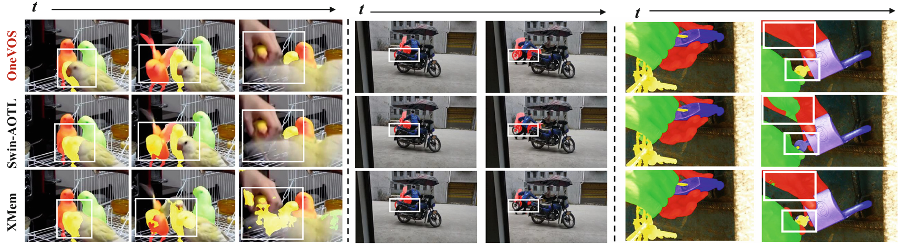
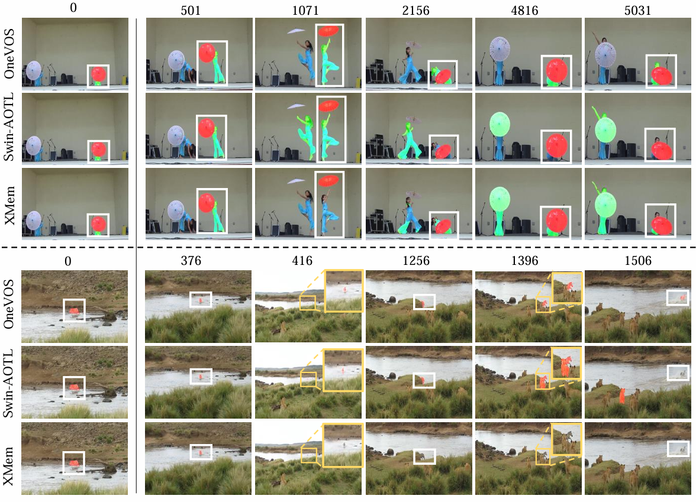

# OneVOS: Unifying Video Object Segmentation with All-in-One Transformer Framework
This repository contains the code for the paper **OneVOS: Unifying Video Object Segmentation with All-in-One Transformer Framework [ECCV'2024]**.

## News
[2024/07] **X-Prompt**: Our new work [X-Prompt: Multimodal Visual Prompt for Video Object Segmentation](https://github.com/PinxueGuo/X-Prompt) has been accepted by **[ACMMM'2024]**. This work proposes a novel multimodal VOS approach,  leveraging OneVOS as the RGB-VOS foundation model and incorporating Multi-modal Adaptation Experts to integrate additional  modality-specific knowledge.  The proposed method achieves **SOTA performance across 4 benchmarks**.

## OneVOS Examples




## Model Zoo and Results
Our trained models, benckmark scores, and pre-computed results reproduced by this project can be found in [MODEL_ZOO.md](MODEL_ZOO.md).

## Getting Started
### Install
```bash
conda create -n vos python=3.9 -y
conda activate vos
pip install torch==1.13.1+cu117 torchvision==0.14.1+cu117 torchaudio==0.13.1 --extra-index-url https://download.pytorch.org/whl/cu117

pip install -r requirements.txt

git clone https://github.com/ClementPinard/Pytorch-Correlation-extension.git
cd Pytorch-Correlation-extension
python setup.py install
cd -
```

#### Prepare Dataset
We follow the same data preparation steps used in [AOT](https://github.com/yoxu515/aot-benchmark?tab=readme-ov-file), including Static datasets, DAVIS and Youtube-VOS. Besides, we also use the more comlicated dataset [MOSE](https://henghuiding.github.io/MOSE) and long-term vos dataset [LVOS V1](https://lingyihongfd.github.io/lvos.github.io/dataset.html) for training or test. 

```bash
├── OneVOS
├── datasets
│   ├── Static
│   │    └── ...
│   ├── DAVIS
│   │    └── ...
│   ├── YOUTUBE-VOS
│   │    └── ...
│   ├── MOSE
│   │    └── ...
│   ├── LVOS
│   │    └── ...
│   ├── ...
```

### Pretrained Backbone Model
We initialize OneVOS using the weights of ConvMAE-Base as the backbone.  You can download the pretrained weights directly from pretrain_backbone and place them in the `OneVOS/pretrain_weights/`.

## Train & Eval
Stages:
- `PRE`: the pre-training stage with static images.
- `PRE_YTB_DAV`: the main-training stage with YouTube-VOS and DAVIS. 
- `PRE_YTB_DAV_MOSE`: the main-training stage with YouTube-VOS and DAVIS and MOSE.


The training script can be referenced [train_examples_pre_ytb_dav.sh](./train_examples_pre_ytb_dav.sh), and [train_examples_pre_ytb_dav_mose.sh](./train_examples_pre_ytb_dav_mose.sh) 

The inference script can be referenced [eval_examples_pre_ytb_dav.sh](./eval_examples_pre_ytb_dav.sh), and   [eval_examples_pre_ytb_dav_mose.sh](./eval_examples_pre_ytb_dav_mose.sh) 


## Citations
If you find this repository useful, please consider giving a star and citation:
```bibtex

@article{li2024onevos,
  title={OneVOS: Unifying Video Object Segmentation with All-in-One Transformer Framework},
  author={Li, Wanyun and Guo, Pinxue and Zhou, Xinyu and Hong, Lingyi and He, Yangji and Zheng, Xiangyu and Zhang, Wei and Zhang, Wenqiang},
  journal={arXiv preprint arXiv:2403.08682},
  year={2024}
}
```